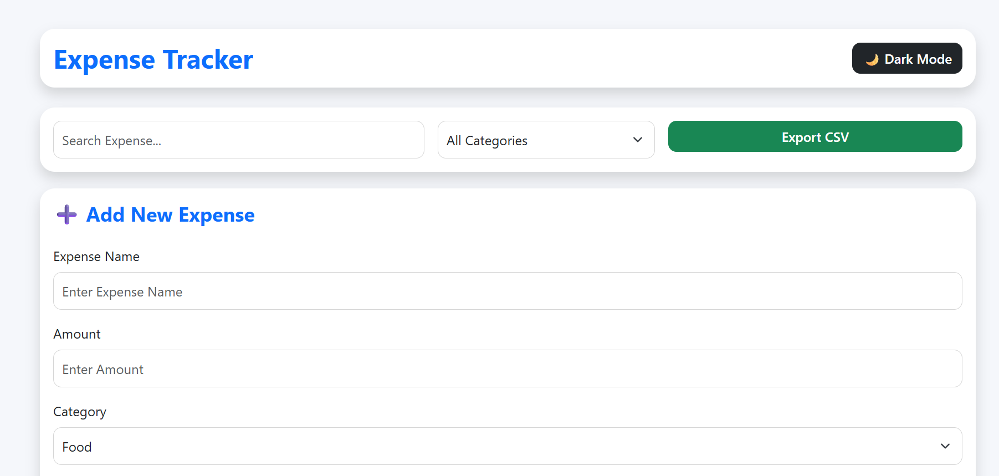
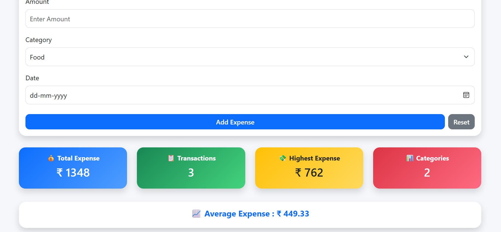
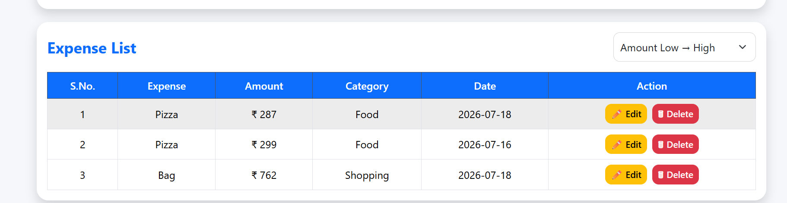
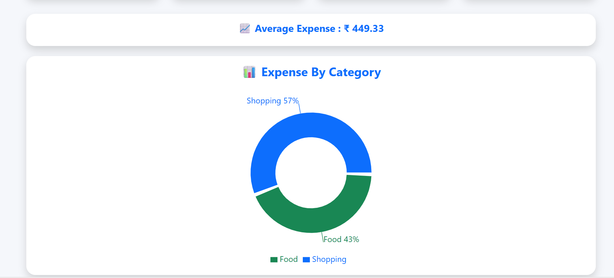

# 💰 Expense Tracker

A responsive Expense Tracker built using **React.js**, **Bootstrap**, **JavaScript**, and **Recharts**. This application helps users manage daily expenses with a clean dashboard, category-wise charts, search, sorting, dark mode, and local storage support.

---

## 🚀 Live Demo

👉 Coming Soon (Netlify Link)

---

## 📸 Project Screenshot

> Add your project screenshot here after deployment.

Example:







---

## ✨ Features

- ✅ Add Expense
- ✅ Edit Expense
- ✅ Delete Expense
- ✅ Search Expense
- ✅ Category Filter
- ✅ Amount Sorting
- ✅ Date Sorting
- ✅ Dashboard Cards
- ✅ Pie Chart
- ✅ Dark Mode
- ✅ Export CSV
- ✅ Local Storage
- ✅ Responsive UI

---

## 🛠 Technologies Used

- React.js
- JavaScript (ES6)
- Bootstrap 5
- HTML5
- CSS3
- Recharts
- Local Storage

---

## 📂 Folder Structure

```
expense-tracker
│
├── public
│
├── src
│   ├── components
│   │   ├── AddExpense.jsx
│   │   ├── ExpenseChart.jsx
│   │   ├── ExpenseList.jsx
│   │   └── TotalExpense.jsx
│   │
│   ├── App.js
│   ├── App.css
│   ├── index.js
│   └── index.css
│
├── package.json
└── README.md
```

---

## ⚙ Installation

Clone the repository

```bash
git clone https://github.com/AnilKachhap/expense-tracker-react.git
```

Go to project folder

```bash
cd expense-tracker-react
```

Install dependencies

```bash
npm install
```

Run the project

```bash
npm start
```

---

## 📊 Future Improvements

- User Authentication
- Expense Reports
- PDF Export
- Backend Integration
- Database Support

---

## 👨‍💻 Author

**Anil Kachhap**

- MCA Graduate (2025)
- Full Stack .NET Developer
- React Developer

GitHub:

https://github.com/AnilKachhap

---

## ⭐ Support

If you like this project, don't forget to ⭐ Star this repository.